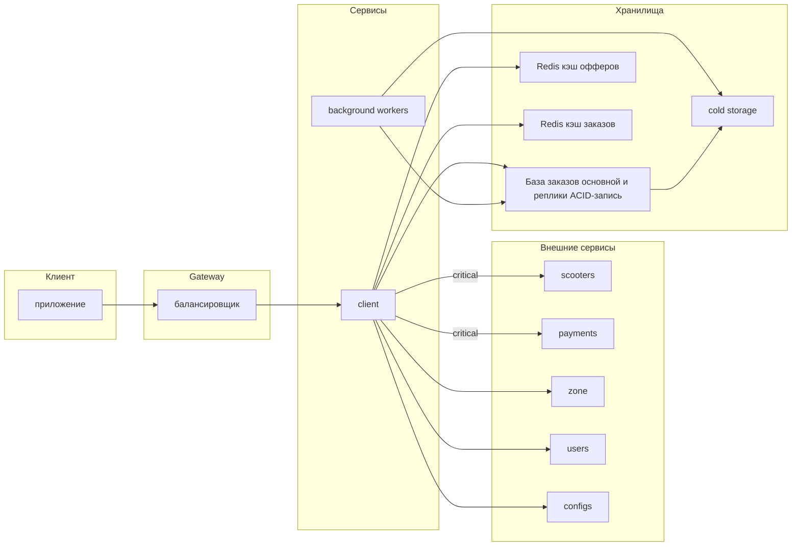
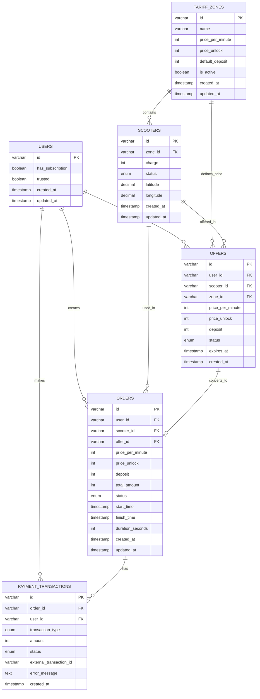

# Architecture Design Record

В этом файле представлен ARD для решения от команды 2.

Входные параметры: _1000_ RPS на создание заказов, _100_ запросов GET на каждый заказ, информация о каждом заказе занимает _100_ Кб.


## Постановка задачи

Необходимо реализовать сервис для обслуживания аренды самокатов. Назовём его `client`, так как он является входной точкой для клиентов.

## Внешние сервисы

##### Критические:
+ `scooters`: получить для самоката заряд и `id` зоны.

+ `payments`: возможность замораживать депозит на карте клиента и списывать стоимость поездки.

##### Некритические:
+ `zone`: По `id` зоны получить депозит, стоимость разблокировки и минуты для неё. 

+ `users`: По `id` пользователя получить его параметры: наличие подписки и обязательность депозита.

+ `configs`: Сервис динамических конфигов.

## Сценарии

#### 1. Создание оффера

+ Пользователь открывает приложение и сканирует QR-код самоката.

+ Приложение получает информацию о самокате и уровне его заряда.

+ Формируется оффер:

  + депозит (в зависимости от доверенности пользователя);

  + стоимость разблокировки самоката (0 если есть подписка);

  + стоимость минуты поездки;

+ Константы из оффера (surge, low_charge_discount, порог низкого заряда, период неоплачиваемой поездки) настраиваются динамическим конфигом.

+ Пользователю показывается рассчитанная цена аренды.

#### 2. Создание заказа

+ Пользователь видит оффер и нажимает на кнопку начала аренды.

+ Если оффер устарел или уже использован, система уведомляет пользователя об этом и генерирует новый оффер.

+ Если же оффер валидный, на карте пользователя замораживается депозит и начинается поездка.

#### 3. Проверка состояния заказа во время поездки

+ В приложении пользователю доступны:

  + время начала поездки;

  + сколько стоит поездка на текущий момент;

  + стоимость минуты поездки;

  + заряд самоката;

#### 4. Завершение заказа

+ Пользователь нажимает кнопку завершения аренды.

+ С карты списывается сумма поездки.

+ Сумма начисляется сервису аренды.

+ Депозит пользователя размораживается.

## Деградация системы при недоступности внешних сервисов (Reliability)

+ Недоступность `scooters`: ошибка при создании оффера (в том числе при обновлении), деградация получения состояния заказа (нет заряда самоката).

+ Недоступность `payments`: невозможно начать или завершить аренду.

+ Недоступность `zone`: сервис хранит кэш параметров офферов для зон. При возрасте кэша меньше 10 минут (величина конфигурируема) используем данные из кэша, иначе возникает ошибка (невозможно создать оффер). _Trade-off: изменения тарифа в зоне распространяется не моментально, зато переживаем недлительную недоступность zone (в том числе единичные потери запросов)._

+ Недоступность `users`: формируем оффер как для юзера без привелегий (платная разблокировка, обязателен депозит). _Trade-off: мы можем обидеть пользователей с подпиской, но в обратном случае может быть фрод._

+ Недоступность `configs`: все значения конфгиов кэшируется с бесконечным TTL. Если сервис конфигов недоступен на старте сервиса, то используются дефолтные значения, указанные в схеме конфига. _Trade-off: на разных инстансах сервиса могут оказаться разные значения конфигов, но эта ситуация будет не так часта. Если же в случае недоступности всегда использовать дефолт, то система может повести себя неожиданно, так как дефолты никто не обновляет._ 


## Расчёт нагрузки (Scalability)

**Запись (Write):**

- Orders creation: 1,000 RPS
- Offers creation: 1,000 RPS
- Payment transactions: 2,000 RPS (hold + clear по 2 на заказ)
- Scooter status updates: 2,000 RPS (обновляется дважды при старте и завершении)
- **Итого запись: ~6,000 RPS**

**Чтение (Read):**

- Order reads: 1,000 RPS × 100 GET (параметр Y) = **100,000 RPS** - предположим что все необходимые валидации входят в 100 get rps на заказ
- **Итого чтение: ~100,000 RPS**

### Объем генерируемых данных:

**За сутки:**

```
Заказов: 1,000 RPS × 86,400 сек = 86,400,000 (86.4M заказов/день)
Объем: 86.4M × 100 КБ = 8,640 ГБ = 8.64 ТБ/день
```

**За год (без архивирования):**

```
Заказов: 86.4M × 365 = 31.5 миллиардов
Объем: 8.64 ТБ × 365 = ~3.15 ПБ
```

**Вывод:** Хранить все данные в активной БД невозможно и неэффективно.

### Стратегия управления данными:

**Hot Storage (активная БД, 1 день):**

- Заказов: 86.4M
- Данные заказов: 8.64 ТБ
- Другие таблицы(users, scooters, zones): <1 TБ - скорее всего и того меньше
- **Активная БД: ~10 ТБ**

**Архивирование:**

- Через **1 день** после создания заказ автоматически перемещается в **cold storage**
- Старые данные доступны через обычный API, но на их получение не действует SLA ответа как на обычном запросе
- Retention в cold storage: 3 года (или иное, если треубется законодательством)

## Архитектурное решение

### Выбор баз данных и их роли:

**Основная БД: PostgreSQL**

Выбрана реляционная СУБД PostgreSQL для хранения критичных данных (заказы, офферы, транзакции), так как необходимы ACID-гарантии для финансовых операций.

**Шардирование:**
- Нагрузка на чтение: 1000 * 100 * 100 Kb / sec = 10 Gb / sec, на запись: 1000 * 100 Kb / sec = 100 Mb / sec.
- При этом основной проблемой будет не нагрузка, а хранение в течение дня информации о заказах. Объём - 10 Тб, лучше пошардировать на несколько дисков.
- Достаточно будет 6 шардов с 2 Тб дисками, данные будут шардироваться по `user_id` для равномерного распределения нагрузки, таким образом i/o не будет проблемой, и ssd можно использовать достаточно медленные.
- Каждый шард будет иметь master для записи и 2 read-реплики для чтения для избежания потери данных.

**Кэширование: Redis**

- Для быстрого ответа на запросы получения данных офферов и заказов используется Redis, так как 100k RPS на чтение в Postgres - слишком много.

- **Offer Cache**: кэширование офферов с TTL 5 минут (время валидности оффера)
- **Order Cache**: кэширование активных заказов с TTL 30 минут для быстрого доступа к статусу

- Предполагаем хранение информации о заказе в кэше Redis примерно 30 минут, поэтому объём кеша составляет примерно 100 Mb / sec * 30*60 sec = 180 Gb, так что с информацией об офферах должно хватить диска на 250 Gb.

- Так как при падении одного инстанса Redis вся нагрузка перейдёт на Postgres, и он может не выдержать, у Redis также должно быть несколько инстансов.

Кэши других данных (zones, configs) можно хранить в key-value в самом сервисе, так как их количество очень мало.

**Cold Storage: S3**

Для архивных данных (старше 1 дня) используется объектное хранилище:
- Данные сжимаются и партиционируются по дате
- Доступ через отдельный API без жёстких SLA по времени ответа
- Retention период: 3 года

## Схема системы



## Основные сущности

### ER-диаграмма базы данных:



## Maintainability

**Обоснование единого сервиса:**

Сервис `client` должен быть реализован как монолит, так как:
- Офферы и заказы тесно связаны логически (оффер конвертируется в заказ)
- Требуется транзакционная консистентность при работе с платежами
- Низкая латентность критична — нет накладных расходов на сетевое взаимодействие между микросервисами
- Упрощается deployment и отладка

**Доменная структура кода:**

Внутри монолита код должен быть организован по доменам:
- **Offers Domain**: логика создания и валидации офферов, расчёт цен
- **Orders Domain**: управление жизненным циклом заказов
- **Payments Domain**: интеграция с платёжным сервисом, обработка ошибок
- **Pricing Domain**: калькуляция стоимости с учётом surge, скидок и конфигов

Каждый домен инкапсулирует свою бизнес-логику и взаимодействует с другими через чётко определённые интерфейсы.

## Consistency
### Гарантии консистентности данных

**Критические требования:**
- Нельзя потерять заказ после успешного холда депозита
- Нельзя списать деньги дважды за один заказ
- Нельзя завершить заказ без разморозки депозита

**Транзакционность:**

Будут использоваться ACID-транзакции PostgreSQL для атомарности операций:
- При создании заказа в одной транзакции: обновляется статус оффера, вызывается payment hold, создаётся запись заказа
- При завершении заказа: обновляется статус, вызываются payment charge и unhold, сохраняются транзакции
- Если любой шаг падает — откатывается вся операция

**Idempotency:**

Все операции создания используют client-generated UUID (order_id), что позволяет безопасно повторять запросы при сетевых ошибках без дублирования.

**Репликация:**

- Синхронная репликация на 2 standby-реплики для критичных данных
- Запись подтверждается только после сохранения на реплике
- При падении master автоматический failover на standby
- Recovery Point Objective (RPO) = 0 (нет потерь данных)
- Recovery Time Objective (RTO) < 60 секунд

**Консистентность кэша:**

- При создании заказа данные пишутся в БД и Redis одновременно (write-through)
- При обновлении статуса заказа кэш инвалидируется
- TTL гарантирует, что даже при рассинхронизации данные обновятся через 30 минут

**Обработка ошибок платежей:**

Если платёжная операция не удалась:
- Заказ помечается как PAYMENT_FAILED
- Background worker периодически повторяет попытки списания
- Отправляются алерты для ручного разбора проблемных случаев

## Observability

### Мониторинг системы

_В данном разделе описаны возможные подходы и метрики для анализа здоровья системы. Они релевантны для зрелых проектов и не входят в MVP приложения._

**Метрики (Prometheus + Grafana):**

Собираются ключевые метрики для отслеживания здоровья системы:

*Бизнес-метрики:*
- Количество созданных офферов и заказов
- Conversion rate (офферы → заказы)
- Количество активных поездок
- Ошибки при работе с платежами
- Суммарная выручка

*Технические метрики:*
- RPS и латентность запросов (p50, p95, p99)
- Процент ошибок по эндпоинтам
- Время выполнения запросов к БД
- Cache hit rate для Redis
- Время ответа внешних сервисов (scooters, payments, zone)
- Состояние connection pool'ов

**Дашборды:**

1. **Business Dashboard**: активные поездки, создание заказов, revenue
2. **Service Health**: latency, error rate, throughput
3. **Infrastructure**: CPU/Memory, database connections, Redis memory

**Логирование (ELK Stack):**

Структурированные JSON-логи с полями:
- timestamp, уровень логирования, trace_id
- user_id, order_id для корреляции событий
- duration запроса

Уровни логирования:
- ERROR: все ошибки требующие внимания
- WARN: деградация (fallback на кэш, недоступность некритичных сервисов)
- INFO: бизнес-события (создан оффер, начата/завершена поездка)

**Алертинг:**

Необходимо настроить алерты на критичные события:
- Error rate > 5% в течение 2 минут
- Latency p99 > 1 секунда
- Недоступность критичных сервисов (scooters, payments)
- Проблемы с репликацией БД
- Падение cache hit rate < 90%

**Трейсинг:**

Распределённый трейсинг запросов для анализа узких мест:
- Отслеживание полного пути запроса через все компоненты
- Определение медленных операций (БД, внешние API, кэш)
- Корреляция ошибок с конкретными вызовами
