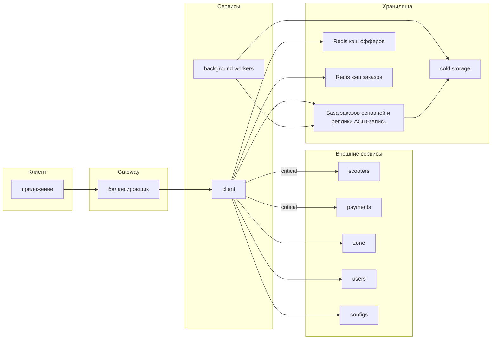
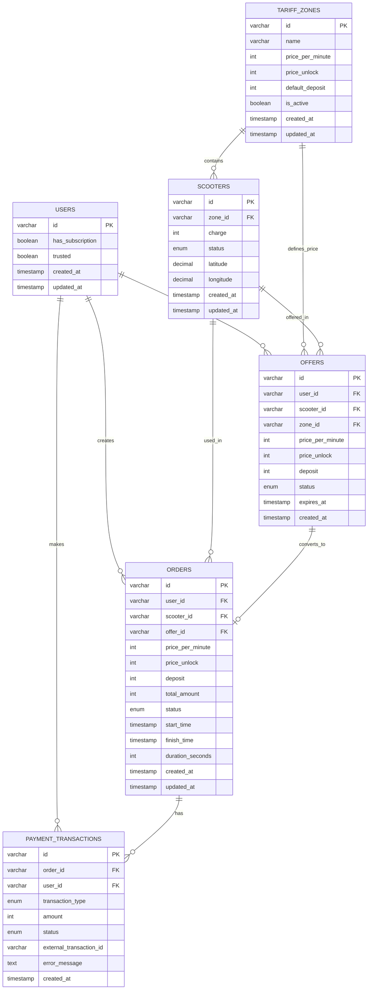

# Architecture Design Record

В этом файле представлен ARD для решения от команды 2.

Входные параметры: _1000_ RPS на создание заказов, _100_ запросов GET на каждый заказ, информация о каждом заказе занимает _100_ Кб.


## Постановка задачи

Необходимо реализовать сервис для обслуживания аренды самокатов. Назовём его `client`, так как он является входной точкой для клиентов.

## Внешние сервисы

##### Критические:
+ `scooters`: получить для самоката заряд и `id` зоны.

+ `payments`: возможность замораживать депозит на карте клиента и списывать стоимость поездки.

##### Некритические:
+ `zone`: По `id` зоны получить депозит, стоимость разблокировки и минуты для неё. 

+ `users`: По `id` пользователя получить его параметры: наличие подписки и обязательность депозита.

+ `configs`: Сервис динамических конфигов.

## Сценарии

#### 1. Создание оффера

+ Пользователь открывает приложение и сканирует QR-код самоката.

+ Приложение получает информацию о самокате и уровне его заряда.

+ Формируется оффер:

  + депозит (в зависимости от доверенности пользователя);

  + стоимость разблокировки самоката (0 если есть подписка);

  + стоимость минуты поездки;

+ Константы из оффера (surge, low_charge_discount, порог низкого заряда, период неоплачиваемой поездки) настраиваются динамическим конфигом.

+ Пользователю показывается рассчитанная цена аренды.

#### 2. Создание заказа

+ Пользователь видит оффер и нажимает на кнопку начала аренды.

+ Если оффер устарел или уже использован, система уведомляет пользователя об этом и генерирует новый оффер.

+ Если же оффер валидный, на карте пользователя замораживается депозит и начинается поездка.

#### 3. Проверка состояния заказа во время поездки

+ В приложении пользователю доступны:

  + время начала поездки;

  + сколько стоит поездка на текущий момент;

  + стоимость минуты поездки;

  + заряд самоката;

#### 4. Завершение заказа

+ Пользователь нажимает кнопку завершения аренды.

+ С карты списывается сумма поездки.

+ Сумма начисляется сервису аренды.

+ Депозит пользователя размораживается.

## Деградация системы при недоступности внешних сервисов (Reliability)

+ Недоступность `scooters`: ошибка при создании оффера (в том числе при обновлении), деградация получения состояния заказа (нет заряда самоката).

+ Недоступность `payments`: невозможно начать или завершить аренду.

+ Недоступность `zone`: сервис хранит кэш параметров офферов для зон. При возрасте кэша меньше 10 минут (величина конфигурируема) используем данные из кэша, иначе возникает ошибка (невозможно создать оффер). _Trade-off: изменения тарифа в зоне распространяется не моментально, зато переживаем недлительную недоступность zone (в том числе единичные потери запросов)._

+ Недоступность `users`: формируем оффер как для юзера без привелегий (платная разблокировка, обязателен депозит). _Trade-off: мы можем обидеть пользователей с подпиской, но в обратном случае может быть фрод._

+ Недоступность `configs`: все значения конфгиов кэшируется с бесконечным TTL. Если сервис конфигов недоступен на старте сервиса, то используются дефолтные значения, указанные в схеме конфига. _Trade-off: на разных инстансах сервиса могут оказаться разные значения конфигов, но эта ситуация будет не так часта. Если же в случае недоступности всегда использовать дефолт, то система может повести себя неожиданно, так как дефолты никто не обновляет._ 


## Расчёт нагрузки (Scalability)

**Запись (Write):**

- Orders creation: 1,000 RPS
- Offers creation: 1,000 RPS
- Payment transactions: 2,000 RPS (hold + clear по 2 на заказ)
- Scooter status updates: 2,000 RPS (обновляется дважды при старте и завершении)
- **Итого запись: ~6,000 RPS**

**Чтение (Read):**

- Order reads: 1,000 RPS × 100 GET (параметр Y) = **100,000 RPS** - предположим что все необходимые валидации входят в 100 get rps на заказ
- **Итого чтение: ~100,000 RPS**

### Объем генерируемых данных:

**За сутки:**

```
Заказов: 1,000 RPS × 86,400 сек = 86,400,000 (86.4M заказов/день)
Объем: 86.4M × 100 КБ = 8,640 ГБ = 8.64 ТБ/день
```

**За год (без архивирования):**

```
Заказов: 86.4M × 365 = 31.5 миллиардов
Объем: 8.64 ТБ × 365 = ~3.15 ПБ
```

**Вывод:** Хранить все данные в активной БД невозможно и неэффективно.

### Стратегия управления данными:

**Hot Storage (активная БД, 2 дня):**

- Заказов: 86.4M × 2 = 172.8M
- Данные заказов: ~17 ТБ
- Другие таблицы(users, scooters, zones): <1 ТБ - скорее всего и того меньше
- **Активная БД: ~18 ТБ**

**Архивирование:**

- Через **2 дня** после создания заказ автоматически перемещается в **cold storage**
- Старые данные доступны через обычный API, но на их получение не действует SLA ответа как на обычном запросе
- Retention в cold storage: 3 года (или иное, если треубется законодательством)

## Архитектурное решение

(какие мы виды баз где используем, для гетов нужен Redis чтобы не загружать основную базу. базы нужно шардировать)

## Схема системы


```mermaid

flowchart LR
subgraph Клиент
A[приложение]
end

subgraph Gateway
ALB[балансировщик]
end

subgraph Сервисы
direction TB
CLIENT[client]
WORKERS[background workers]
end

subgraph Внешние сервисы
SCOOTERS[scooters]
PAYMENTS[payments]
ZONE[zone]
USERS[users]
CONFIGS[configs]
end

subgraph Хранилища
ORDERS_DB[База заказов основной и реплики ACID-запись]
COLD[cold storage]
OFFER_CACHE[Redis кэш офферов]
ORDER_CACHE[Redis кэш заказов]
end

A --> ALB
ALB --> CLIENT
CLIENT --> OFFER_CACHE
CLIENT --> ORDER_CACHE
CLIENT --> ORDERS_DB
CLIENT -->|critical| SCOOTERS
CLIENT -->|critical| PAYMENTS
CLIENT --> ZONE
CLIENT --> USERS
CLIENT --> CONFIGS

WORKERS --> ORDERS_DB
WORKERS --> COLD

ORDERS_DB --> COLD

```

## Основные сущности

### ER-диаграмма базы данных:


```mermaid
erDiagram
    USERS ||--o{ ORDERS : "creates"
    USERS ||--o{ OFFERS : "receives"
    USERS ||--o{ PAYMENT_TRANSACTIONS : "makes"

    TARIFF_ZONES ||--o{ SCOOTERS : "contains"
    TARIFF_ZONES ||--o{ OFFERS : "defines_price"

    SCOOTERS ||--o{ OFFERS : "offered_in"
    SCOOTERS ||--o{ ORDERS : "used_in"

    OFFERS ||--o| ORDERS : "converts_to"

    ORDERS ||--o{ PAYMENT_TRANSACTIONS : "has"

    USERS {
        varchar id PK
        boolean has_subscription
        boolean trusted
        timestamp created_at
        timestamp updated_at
    }

    TARIFF_ZONES {
        varchar id PK
        varchar name
        int price_per_minute
        int price_unlock
        int default_deposit
        boolean is_active
        timestamp created_at
        timestamp updated_at
    }

    SCOOTERS {
        varchar id PK
        varchar zone_id FK
        int charge
        enum status
        decimal latitude
        decimal longitude
        timestamp created_at
        timestamp updated_at
    }

    OFFERS {
        varchar id PK
        varchar user_id FK
        varchar scooter_id FK
        varchar zone_id FK
        int price_per_minute
        int price_unlock
        int deposit
        enum status
        timestamp expires_at
        timestamp created_at
    }

    ORDERS {
        varchar id PK
        varchar user_id FK
        varchar scooter_id FK
        varchar offer_id FK
        int price_per_minute
        int price_unlock
        int deposit
        int total_amount
        enum status
        timestamp start_time
        timestamp finish_time
        int duration_seconds
        timestamp created_at
        timestamp updated_at
    }

    PAYMENT_TRANSACTIONS {
        varchar id PK
        varchar order_id FK
        varchar user_id FK
        enum transaction_type
        int amount
        enum status
        varchar external_transaction_id
        text error_message
        timestamp created_at
    }
```

## Maintainability

(тут наверное что-то сказать про разделение кода на логические домены, и что наш сервис действительно должен быть одним сервисом)

## Consistency

(тут про то как мы не теряем заказы и деньги, что в базу точно всё положим, может реплицировать надо базу.)

## Observability

(логов накинуть, что-то даже про графики говорили. Если доп баллы дадут то можно построить)
