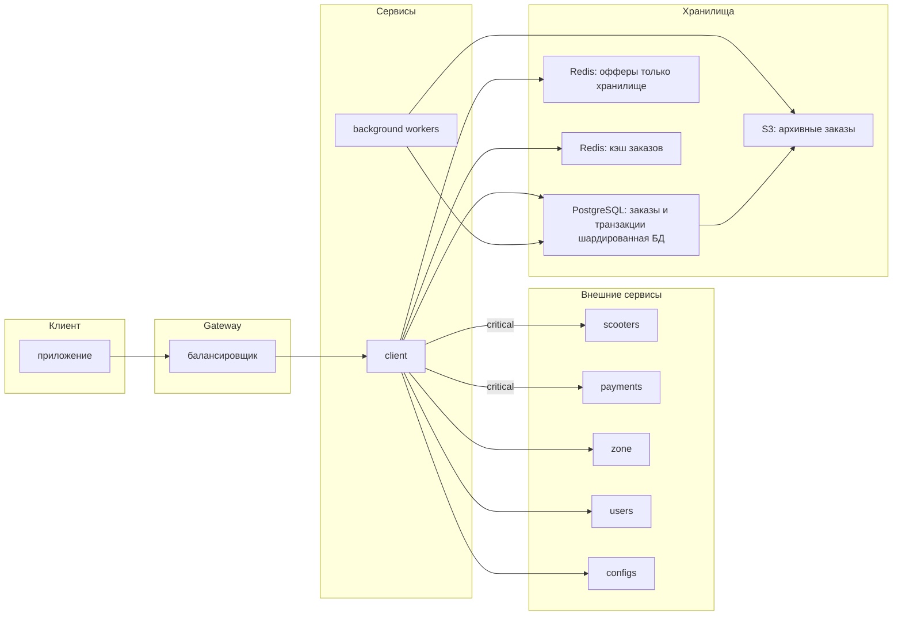
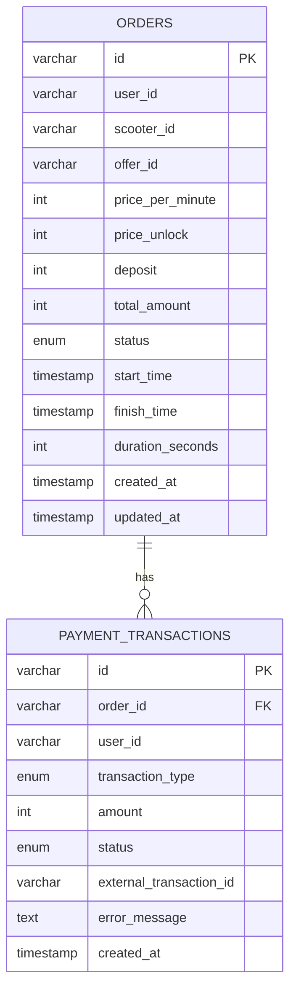

# Architecture Design Record

В этом файле представлен ARD для решения от команды 2.

Входные параметры: _1000_ RPS на создание заказов, _100_ запросов GET на каждый заказ, информация о каждом заказе занимает _100_ Кб.


## Постановка задачи

Необходимо реализовать сервис для обслуживания аренды самокатов. Назовём его `client`, так как он является входной точкой для клиентов.

## Внешние сервисы

##### Критические:
+ `scooters`: получить для самоката заряд и `id` зоны.

+ `payments`: возможность замораживать депозит на карте клиента и списывать стоимость поездки.

##### Некритические:
+ `zone`: По `id` зоны получить депозит, стоимость разблокировки и минуты для неё. 

+ `users`: По `id` пользователя получить его параметры: наличие подписки и обязательность депозита.

+ `configs`: Сервис динамических конфигов.

## Сценарии

#### 1. Создание оффера

+ Пользователь открывает приложение и сканирует QR-код самоката.

+ Приложение получает информацию о самокате и уровне его заряда.

+ Формируется оффер:

  + депозит (в зависимости от доверенности пользователя);

  + стоимость разблокировки самоката (0 если есть подписка);

  + стоимость минуты поездки;

+ Константы из оффера (surge, low_charge_discount, порог низкого заряда, период неоплачиваемой поездки) настраиваются динамическим конфигом.

+ Пользователю показывается рассчитанная цена аренды.

#### 2. Создание заказа

+ Пользователь видит оффер и нажимает на кнопку начала аренды.

+ Если оффер устарел или уже использован, система уведомляет пользователя об этом и генерирует новый оффер.

+ Если же оффер валидный, на карте пользователя замораживается депозит и начинается поездка.

#### 3. Проверка состояния заказа во время поездки

+ В приложении пользователю доступны:

  + время начала поездки;

  + сколько стоит поездка на текущий момент;

  + стоимость минуты поездки;

  + заряд самоката;

#### 4. Завершение заказа

+ Пользователь нажимает кнопку завершения аренды.

+ С карты списывается сумма поездки.

+ Сумма начисляется сервису аренды.

+ Депозит пользователя размораживается.

## Деградация системы при недоступности внешних сервисов (Reliability)

+ Недоступность `scooters`: ошибка при создании оффера (в том числе при обновлении), деградация получения состояния заказа (нет заряда самоката).

+ Недоступность `payments`: невозможно начать или завершить аренду.

+ Недоступность `zone`: сервис хранит кэш параметров офферов для зон. При возрасте кэша меньше 10 минут (величина конфигурируема) используем данные из кэша, иначе возникает ошибка (невозможно создать оффер). _Trade-off: изменения тарифа в зоне распространяется не моментально, зато переживаем недлительную недоступность zone (в том числе единичные потери запросов)._

+ Недоступность `users`: формируем оффер как для юзера без привелегий (платная разблокировка, обязателен депозит). _Trade-off: мы можем обидеть пользователей с подпиской, но в обратном случае может быть фрод._

+ Недоступность `configs`: все значения конфигов кэшируется с бесконечным TTL. Если сервис конфигов недоступен на старте сервиса, то используются дефолтные значения, указанные в схеме конфига. _Trade-off: на разных инстансах сервиса могут оказаться разные значения конфигов, но эта ситуация будет не так часта. Если же в случае недоступности всегда использовать дефолт, то система может повести себя неожиданно, так как дефолты никто не обновляет._


## Расчёт нагрузки (Scalability)

<<<<<<< HEAD
**Запись (Write):**

- Orders creation: 1,000 RPS
- Offers creation: 1,000 RPS
- Payment transactions: 2,000 RPS (hold + clear по 2 на заказ)
- Scooter status updates: 2,000 RPS (обновляется дважды при старте и завершении)
- **Итого запись: ~6,000 RPS**

**Чтение (Read):**

- Order reads: 1,000 RPS × 100 GET (параметр Y) = **100,000 RPS** - предположим что все необходимые валидации входят в 100 get rps на заказ
- **Итого чтение: ~100,000 RPS**

### Объем генерируемых данных:

**За сутки:**

```
Заказов: 1,000 RPS × 86,400 сек = 86,400,000 (86.4M заказов/день)
Объем: 86.4M × 100 КБ = 8,640 ГБ = 8.64 ТБ/день
```

**За год (без архивирования):**

```
Заказов: 86.4M × 365 = 31.5 миллиардов
Объем: 8.64 ТБ × 365 = ~3.15 ПБ
```

**Вывод:** Хранить все данные в активной БД невозможно и неэффективно.

### Стратегия управления данными:

**Hot Storage (активная БД, 1 день):**

- Заказов: 86.4M
- Данные заказов: 8.64 ТБ
- Другие таблицы(users, scooters, zones): <1 TБ - скорее всего и того меньше
- **Активная БД: ~10 ТБ**

**Архивирование:**

- Через **1 день** после создания заказ автоматически перемещается в **cold storage**
- Старые данные доступны через обычный API, но на их получение не действует SLA ответа как на обычном запросе
- Retention в cold storage: 3 года (или иное, если треубется законодательством)

## Архитектурное решение

### Выбор баз данных и их роли:

**Разделение хранилищ по профилю нагрузки:**

Заказы, офферы и транзакции имеют разные профили нагрузки и требования к хранению:

- **Заказы**: высокая нагрузка на чтение (100k RPS), большой объём данных (8.64 ТБ/день), требуют долгого хранения, нужны ACID-гарантии
- **Офферы**: низкая нагрузка на чтение, короткий TTL, не требуют долгого хранения, не критичны для финансов
- **Транзакции**: средняя нагрузка, критичны для финансов, требуют ACID-гарантий, нужны для аудита

Рассмотренные виды баз данных:

1. **Реляционные** (i.e. Postgres, выбрано для хранения заказов и транзакций)

    `Преимущества`
    - Экономия места за счёт чёткой схемы данных
    - ACID-транзакции
    - SQL-запросы и индексы: позволяют эффективно получать интересующую информацию: заказы клиента, заказы за отрезок времени и т.д.

    `Недостатки`
    - Не очень большая производительность (хранение на диске), нужно шардировать
    - Может быть сложно поддерживать работу при сложной системе

2. **Key-Value хранилища** (i.e. Redis, выбрано для хранения офферов)

    `Преимущества`
    - Быстрые запросы
    - Удобно использовать как кэш

    `Недостатки`
    - Теряется часть данных при падении
    - Нет ACID транзакций

3. **Документные базы** (i.e. MongoDB)

    `Преимущества`
    - Не нужна схема для хранения
    - Простота в масштабировании

    `Недостатки`
    - Нет ACID транзакций
    - Тратится больше памяти
    - Сложные SQL запросы к базе могут быть неэффективными

Этот вариант имеет смысл, если о заказе хранится 100 Кб неструктурированной информации. Но за неимением более точной информации в ТЗ мы предполагаем, что храним в основном структурированную информацию (возможно таймстемпы, маршрут, отзыв пользователя после заказа), поэтому мы выигрываем от наличия схемы данных.

4. **Колоночные таблицы** (i.e. Clickhouse)

    `Преимущества`
    - Очень быстрые аналитические запросы

    `Недостатки`
    - Не подходит, если мы часто обновляем случайные строки 

Итого, для хранения заказов и критических данных был выбран Postgres, так как только у него есть комбинация надёжности и ACID-транзакций. А для хранения временных данных (офферов) был выбран Redis как самый производительный и простой в эксплуатации.

**Orders Database: PostgreSQL (шардированная)**

Выбрана реляционная СУБД PostgreSQL для хранения заказов и транзакций, так как необходимы ACID-гарантии для финансовых операций. Заказы и транзакции хранятся вместе, так как они тесно связаны и требуют транзакционной консистентности.

**Offers Storage: Redis**

Офферы хранятся только в Redis, без персистентного хранилища, так как:
- Офферы имеют короткий TTL и не требуют долгого хранения
- Низкая нагрузка на чтение офферов не требует шардирования
- После конвертации оффера в заказ вся необходимая информация сохраняется в заказе

**Масштабирование базы данных заказов:**

**Рассмотренные альтернативы технологии масштабирования:**

1. **Горизонтальное масштабирование (шардирование)** (выбрано)

    `Преимущества`
    - Масштабирование по объёму данных: 8.64 ТБ/день не помещается на один диск
    - Масштабирование по нагрузке: распределение 100k RPS чтения и 1k RPS записи между шардами
    - Возможность использовать более дешёвое железо (несколько серверов с 2 ТБ дисками дешевле одного с 12+ ТБ)
    - Отказоустойчивость: падение одного шарда не останавливает всю систему

    `Недостатки`
    - Сложность реализации (маршрутизация запросов, кросс-шардовые запросы)
    - Усложнение операций (backup, мониторинг, миграции)

2. **Вертикальное масштабирование (более мощный сервер)**
    
    `Преимущества`
    - Простота реализации (одна БД)
    - Нет проблем с кросс-шардовыми запросами
    - Проще операции (backup, мониторинг)

    `Недостатки`
    - Ограничения по объёму: сложно найти диск >10 ТБ с нужной производительностью
    - Ограничения по производительности: 100k RPS чтения сложно обеспечить на одном сервере
    - Высокая стоимость мощного сервера
    - Единая точка отказа

3. **Партиционирование таблиц (partitioning) без шардирования**

    `Преимущества`
    - Просто реализовать
    - Упрощённое архивирование (можно дропать старые партиции)
    - Улучшение производительности запросов по дате

    `Недостатки`
    - Не решает проблему объёма (все партиции на одном сервере)
    - Не масштабирует нагрузку (все запросы идут на один сервер)

Было выбрано горизонтальное масштабирование, так как только этот подход может реалистично решить проблемы большого объёма данных и высокой нагрузки. При вертикальном масштабировании и партицинировании нужен сервер, способный в одиночку сохранить все данные и обработать все запросы, поэтому ему будут необходимы: огромный диск, быстрая оперативная память, также ботлнеком может стать скорость процессора или соединения с интернетом, и один сервер с такими характеристиками будет намного дороже нескольких commodity машин. 
Также этот выбор оправдан в рамках репликации: нам нужен будет настолько же мощный сервер для read-реплики, а также единый сервер будет единой точкой отказа - при шардировании падение одного мастера затронет только часть запросов.

**Выбор параметра шардирования:**

**Рассмотренные альтернативы:**

1. **Шардирование по `user_id`** `(выбрано)`
    
    `Преимущества`
    - Равномерное распределение нагрузки (предполагаем равномерное распределение пользователей)
    - Простые запросы по пользователю (все заказы пользователя на одном шарде)

    `Недостатки`
    - Сложность кросс-шардовых запросов (например, по дате или самокату)

2. **Шардирование по `order_id`**
    
    `Преимущества`
    - Наиболее равномерное распределение объема данных
    - Простые запросы по конкретному заказу

    `Недостатки`
    - Запросы по пользователю требуют запросов ко всем шардам, а таких запросов больше всего

3. **Шардирование по дате создания**

    `Преимущества`
    - Простые запросы по дате
    - Упрощённое архивирование (весь шард можно архивировать)

    `Недостатки`
    - Неравномерная нагрузка (новые шарды горячие, старые холодные)
    - Запросы по пользователю требуют запросов ко всем шардам
    

**Поиск заказов при шардировании по `user_id`:**

- **По `order_id`**: используется индекс на `order_id`, но требуется запрос ко всем шардам (или поддержка lookup-таблицы `order_id -> shard_id`)
- **По `user_id`**: прямой запрос к одному шарду через `hash(user_id) % num_shards`
- **По `user_id` + дате**: запрос к одному шарду с фильтром по дате (индекс на `(user_id, created_at)`)
- **По другим полям**: требуется запрос ко всем шардам (медленно, используется только для аналитики или через отдельный индекс/поисковую систему)

Итого, учитывая равномерность распределения нагрузки при шардировании по `user_id`, а также профиль возможных запросов к базе (самый популярный способ группировки заказов - по пользователю, это интересует самого пользователя и поддержку / антифрод), выбран вариант поиска заказов по `user_id` + дате.

**Кэширование: Redis**

**Рассмотренные альтернативы:**

1. **Только Redis для офферов, кэш для заказов** (выбрано)
    - Офферы хранятся только в Redis (не нужна персистентность)
    - Заказы кэшируются в Redis, но персистентно хранятся в PostgreSQL
    - При падении Redis офферы пересоздаются, заказы доступны из БД
    - Хоть шардированный PostgreSQL и справляется с нагрузкой на чтение заказов через read-реплики, кэширование в Redis полезно: снижение задержек (Redis ~0.1-1 мс, PostgreSQL ~1-10 мс), уменьшение нагрузки на БД (позволяет использовать меньше реплик, снизить нагрузку на диски), эффективное кэширование "горячих" данных (активные заказы читаются 100 раз каждый), защита от пиков нагрузки

2. **Только Redis для всего**

    `Преимущества`
    - Очень высокая производительность

    `Недостатки`
    - Потеря данных при падении Redis (даже с persistence)
    - Сложность обеспечения ACID для финансовых операций
    - Не подходит для критичных данных (заказы, транзакции)

3. **Только PostgreSQL**

    `Преимущества`
    - ACID-гарантии

    `Недостатки`
    - 100k RPS на чтение слишком много даже для шардированной БД
    - Высокие задержки

Итого, второй вариант нам не подходит, а выбирая между первым и третьим мы решили добавить кэширование заказов в Redis из-за получаемых преимущств: снижение задержки за счёт хранения в RAM, а также защита Postgres от скачков нагрузки - без кэша временно увеличившееся количество read запросов могло бы перегрузить базу, а использование Redis оставляет на базе только write запросы, которых в разы меньше, и мы сможем принимать заказы в нормальном режиме. 

**Offers Storage (Redis):**
- Офферы хранятся **только** в Redis, без персистентного хранилища
- TTL оффера 5 минут 
- Объём кэша в один момент времени: 1000 RPS × 5 мин × 60 сек × ~1 КБ = 300,000 офферов × 1 КБ = ~300 МБ
- При падении Redis офферы пересоздаются при следующем запросе

**Order Cache (Redis):**
- Кэширование активных заказов с TTL 30 минут для быстрого доступа к статусу
- При создании/обновлении заказа данные пишутся в БД и Redis
- Объём кэша в один момент времени: 1000 RPS × 30 мин × 60 сек × 100 КБ = 1,800,000 заказов × 100 КБ = ~180 ГБ
- При падении Redis заказы доступны из PostgreSQL

**Высокая доступность Redis:**
- Redis кластер с репликацией для отказоустойчивости
- При падении одного инстанса нагрузка распределяется между остальными
- Fallback на PostgreSQL для заказов при полном падении Redis

Кэши других данных (zones, configs) хранятся в памяти сервиса, так как их количество очень мало.

**Cold Storage: S3**

Для архивных данных (старше 1 дня) используется объектное хранилище S3:
- **Хранятся только заказы и транзакции** (офферы не архивируются, так как они не требуют долгого хранения и вся необходимая информация уже сохранена в заказе)
- Данные сжимаются (gzip) и партиционируются по дате создания заказа
- Формат: `s3://bucket/orders/YYYY/MM/DD/orders_YYYYMMDD_HH.json.gz`
- Доступ через отдельный API без жёстких SLA по времени ответа
- Retention период: 3 года

**Структура архивных данных в S3:**

- **Партиционирование по дате:**
  - Иерархия: `YYYY/MM/DD/` позволяет эффективно фильтровать данные по дате
  - Каждый час создаётся отдельный файл для равномерного распределения данных
  - Партиционирование происходит по дате создания заказа (транзакции партиционируются по дате связанного заказа)
  - Пример структуры:
    ```
    s3://bucket/orders/
    ├── 2024/
    │   ├── 11/
    │   │   ├── 22/
    │   │   │   ├── orders_20241122_00.json.gz  (заказы и транзакции с 00:00 до 00:59)
    │   │   │   ├── orders_20241122_01.json.gz  (заказы и транзакции с 01:00 до 01:59)
    │   │   │   ├── ...
    │   │   │   └── orders_20241122_23.json.gz (заказы и транзакции с 23:00 до 23:59)
    │   │   └── 23/
    │   │       └── ...
    │   └── 12/
    └── 2025/
    ```

- **Формат данных:**
  - **JSON Lines (ndjson)**: каждая строка - отдельный JSON-объект (заказ или транзакция)
  - **Сжатие gzip**: уменьшение объёма данных в 5-10 раз
  - **Структура данных в архиве:**
    ```json
    {"type":"order","id":"order-123","user_id":"user-1","scooter_id":"scooter-1","created_at":"2024-11-22T10:30:00Z",...}
    {"type":"transaction","id":"tx-456","order_id":"order-123","amount":1000,"created_at":"2024-11-22T10:30:05Z",...}
    {"type":"order","id":"order-124","user_id":"user-2","scooter_id":"scooter-2","created_at":"2024-11-22T10:31:00Z",...}
    ```
  - Заказы и транзакции хранятся в одном файле, отсортированные по времени создания

- **Процесс архивирования:**
  - Background worker периодически (каждый час) перемещает заказы и транзакции старше 24 часов из PostgreSQL в S3
  - Заказы и транзакции группируются по часу создания заказа и записываются в соответствующий файл
  - После успешной записи в S3 данные удаляются из PostgreSQL (или помечаются как архивированные)

- **Преимущества такой структуры:**
  - Эффективный поиск по дате: достаточно знать путь к партиции
  - Минимизация скачиваемых данных: можно загрузить только нужные файлы
  - Параллельная обработка: разные файлы можно обрабатывать независимо
  - Экономия места: сжатие gzip значительно уменьшает объём
  - Простота архивирования: можно удалять целые партиции по истечении retention периода

**Поиск данных в S3:**

Для поиска заказов по `user_id` + дате в S3:
1. Определяется путь к партициям по дате: `s3://bucket/orders/YYYY/MM/DD/`
2. Скачиваются файлы за запрашиваемый день (до 24 файлов по часам: `orders_YYYYMMDD_HH.json.gz`)
3. Файлы распаковываются (gzip) и фильтруются по `user_id` в памяти (для заказов) или по `order_id` (для транзакций)
4. Результаты объединяются и сортируются по `created_at`

Ограничения: поиск медленный (секунды), требует скачивания и фильтрации всех файлов за день в памяти, независимо от поля поиска, но это нормально для холодного хранилища, предполагается, что обращения к нему нечастые.

## Схема системы



## Основные сущности

### ER-диаграмма базы данных:

ER-диаграмма показывает только сущности, хранящиеся в нашей базе данных PostgreSQL:



### Внешние сущности

Наш сервис не хранит следующие сущности в своей базе данных, а получает их через API внешних сервисов:

**USERS** (внешний сервис `users`):
- Управление пользователями осуществляется внешним сервисом `users`
- Поля: `id`, `has_subscription`, `trusted`
- Взаимодействие: HTTP API запросы при создании оффера

**SCOOTERS** (внешний сервис `scooters`):
- Управление самокатами осуществляется внешним сервисом `scooters`
- Поля: `id`, `zone_id`, `charge`, `status`, `latitude`, `longitude`
- Взаимодействие: HTTP API запросы при создании оффера и проверке состояния заказа

**TARIFF_ZONES** (внешний сервис `zone`):
- Управление тарифными зонами осуществляется внешним сервисом `zone`
- Поля: `id`, `name`, `price_per_minute`, `price_unlock`, `default_deposit`, `is_active`
- Взаимодействие: HTTP API запросы при создании оффера, данные кэшируются с TTL 10 минут

**OFFERS** (внутренняя сущность, но хранится в Redis, не в БД):
- Офферы хранятся только в Redis с TTL 5 минут
- Поля: `id`, `user_id`, `scooter_id`, `zone_id`, `price_per_minute`, `price_unlock`, `deposit`, `status`, `expires_at`
- Взаимодействие: создание и чтение через Redis API

**Обоснование разделения:**

Выбор не хранить эти сущности в нашей БД обусловлен следующими причинами:
- **Разделение ответственности**: каждый сервис управляет своими доменными сущностями (users управляет пользователями, scooters - самокатами и т.д.)
- **Независимость сервисов**: изменения в структуре внешних сущностей не требуют миграций в нашей БД
- **Консистентность данных**: единственный источник истины для каждой сущности - её сервис-владелец
- **Масштабирование**: каждый сервис может масштабироваться независимо
- **Офферы в Redis**: офферы имеют короткий TTL и не требуют долгого хранения, после конвертации в заказ вся информация сохраняется в заказе

## Maintainability

**Архитектура сервиса:**

**Рассмотренные альтернативы:**

1. **Единый монолитный сервис** (выбрано)
    
    `Преимущества`
    - Офферы и заказы тесно связаны логически (оффер конвертируется в заказ)
    - Требуется транзакционная консистентность при работе с платежами
    - Низкие задержки критична - нет накладных расходов на сетевое взаимодействие между микросервисами
    - Упрощается deployment и отладка
    - Проще обеспечить консистентность данных

    `Недостатки`
    - Монолит сложнее масштабировать независимо

2. **Разделение на два сервиса: Offers Service и Orders Service**

    `Преимущества`
    - Независимое масштабирование (офферы имеют низкую нагрузку на чтение)
    - Независимый deployment

    `Недостатки`
    - Сетевое взаимодействие между сервисами увеличивает задержки
    - Сложность обеспечения транзакционной консистентности при создании заказа
    - Усложнение архитектуры без значительных преимуществ

**Выбор: единый монолитный сервис**

**Доменная структура кода:**

Внутри монолита код должен быть организован по доменам:
- **Offers Domain**: логика создания и валидации офферов, расчёт цен
- **Orders Domain**: управление жизненным циклом заказов
- **Payments Domain**: интеграция с платёжным сервисом, обработка ошибок
- **Pricing Domain**: калькуляция стоимости с учётом surge, скидок и конфигов

Каждый домен инкапсулирует свою бизнес-логику и взаимодействует с другими через чётко определённые интерфейсы.

## Consistency
### Гарантии консистентности данных

**Критические требования:**
- Нельзя потерять заказ после успешного холда депозита
- Нельзя списать деньги дважды за один заказ
- Нельзя завершить заказ без разморозки депозита

**Транзакционность:**

Будут использоваться ACID-транзакции PostgreSQL для атомарности операций:
- При создании заказа в одной транзакции: создаётся запись заказа, вызывается payment hold, сохраняются транзакции
  - Примечание: оффер не обновляется в БД, так как он хранится только в Redis и помечается как использованный через атомарную операцию Redis
- При завершении заказа: обновляется статус, вызываются payment charge и unhold, сохраняются транзакции
- Если любой шаг падает - откатывается вся операция

**Idempotency:**

**Рассмотренные альтернативы ключа идемпотентности создания заказа:**

1. **Клиентское приложение генерирует id заказа как UUID** (выбрано)
   - Клиентское приложение (приложение пользователя) генерирует UUID перед отправкой запроса на создание заказа

   `Преимущества`
   - Позволяет безопасно повторять запросы при сетевых ошибках без дублирования
   - Не требует дополнительных запросов к нашему сервису для генерации ID
   - Работает в распределённой системе без координации

   `Недостатки`
   - Требует передачи order_id от клиентского приложения
   - Некорректный клиент может создавать некорректные или уже использованные id, такие случаи надо проверять на стороне сервера.

2. **Наш сервис генерирует ID заказа (sequence/auto-increment/UUID)**
   - Наш сервис `client` генерирует ID при получении запроса (может быть sequence, auto-increment или UUID)

   `Преимущества`
   - Проще для клиентского приложения (не нужно генерировать ID)

   `Недостатки`
   - Сложность обеспечения идемпотентности (нужен отдельный idempotency key от клиента)
   - Для sequence/auto-increment: проблемы с шардированием (нужны глобальные последовательности)
   - Для UUID: нет проблем с шардированием, но всё равно нужен idempotency key для идемпотентности

3. **В качестве ключа идемпотентности используется `offer_id`**
    - Используется id оффера, используемого в заказе.

   `Преимущества`
   - Ключ зафиксирован до генерации `id` заказа
   - Простота в реализации и отладке

   `Недостатки`
   - Оффер может истечь в процессе создания заказа, нужно избежать некорректного поведения в этой ситуации (создание заказа и на старый, и на новый оффер).
   - Бизнес логика оффера может измениться, так что он перестанет подходить в качестве ключа идемпотентности. 

Итого, мы выбрали первый вариант - клиент генерирует id заказа. Он достаточно прост в реализации и не зависит от бизнес логики приложения, что важно для технического токена.

**Идемпотентные операции:**

Следующие операции должны быть идемпотентными для обеспечения надёжности при сетевых ошибках и повторных запросах:

1. **Создание заказа** (критично)
   - Механизм: проверка по `order_id` - если заказ уже существует с тем же `order_id`, возвращается существующий заказ
   - Обоснование: предотвращает дублирование заказов при сетевых ошибках, когда клиент не получил ответ и повторяет запрос
   - Реализация: клиентское приложение генерирует UUID и передаёт в запросе, сервис проверяет существование перед созданием

2. **Завершение заказа** (критично)
   - Механизм: проверка статуса заказа - если заказ уже завершён, возвращается текущий статус
   - Обоснование: предотвращает повторное списание средств и повторную разморозку депозита
   - Реализация: проверка статуса заказа перед выполнением операций завершения

3. **Вызовы платёжного сервиса (payment hold/charge/unhold)** (критично)
   - Мы полагаемся на то, что платёжный сервис `payments` корректно обеспечивает идемпотентность операций

4. **Создание оффера** (желательно для оптимизации)
   - Механизм: проверка кэша Redis перед созданием - если оффер с такими параметрами (user_id, scooter_id) уже существует и валиден (не истёк и не близок к концу TTL, не использован), возвращаем существующий из кэша
   - Обоснование: предотвращает избыточные запросы к внешним сервисам (scooters, zone, users) при повторных запросах оффера (обновление экрана, повторное открытие приложения)
   - Реализация: при запросе на создание оффера проверяем Redis по ключу `offer:{user_id}:{scooter_id}`, если есть валидный - возвращаем, если нет - создаём новый и кэшируем

**Операции, которые НЕ должны быть идемпотентными:**
- Получение информации о заказе (GET запросы)
- Получение информации об оффере (GET запросы) 

**Репликация базы данных:**

**Синхронная репликация PostgreSQL для критичных операций:**

Речь идёт о репликации базы данных PostgreSQL (шардов с заказами и транзакциями). Каждый шард PostgreSQL имеет master для записи и реплику для чтения и отказоустойчивости.

Синхронная репликация на standby-реплику используется для операций, где потеря данных недопустима:

**Критичные сценарии, требующие RPO = 0:**

1. **Создание заказа после успешного payment hold**
   - Сценарий при асинхронной репликации: payment hold выполнен (депозит заморожен), заказ записан на master, но master упал до того, как данные попали на реплику
   - Проблема: заказ есть только на master, а он недоступен, но депозит заморожен => деньги пользователя "висят", заказ "не существует", не можем предоставить пользователю услугу, хотя деньги взяли
   - Решение: запись подтверждается только после сохранения на реплике, поэтому если master упадёт, заказ уже сохранён на реплике и может быть восстановлен

2. **Завершение заказа после payment charge**
   - Сценарий при асинхронной репликации: payment charge выполнен (деньги списаны), статус завершения записан на master, но master упал до репликации
   - Проблема: статус завершения есть только на master, а он недоступен, заказ остаётся в статусе "активен" на репликах, но деньги уже списаны => рассинхронизация данных
   - Решение: статус завершения сохраняется на реплике до подтверждения, поэтому при падении master данные уже на реплике

3. **Сохранение payment транзакций**
   - Сценарий при асинхронной репликации: транзакция записана на master, но master упал до репликации
   - Проблема: транзакция есть только на master, а он недоступен => проблемы с аудитом и восстановлением данных
   - Решение: транзакция сохраняется на реплике до подтверждения, поэтому при падении master данные уже на реплике

**Реализация:**
- Синхронная репликация на standby-реплику для операций создания/завершения заказа и сохранения транзакций
- Запись подтверждается только после сохранения на реплике
- При падении master автоматический failover на standby
- Recovery Point Objective (RPO) = 0 (нет потерь данных)
- Recovery Time Objective (RTO) < 60 секунд

**Для read-реплик:** асинхронная репликация (приемлемая задержка для чтения)

**Консистентность кэша:**

- При создании заказа данные пишутся в БД и Redis одновременно (write-through)
- При обновлении статуса заказа кэш инвалидируется
- TTL гарантирует, что даже при рассинхронизации данные обновятся через 30 минут

**Обработка ошибок платежей:**

Если платёжная операция не удалась:
- Заказ помечается как PAYMENT_FAILED
- Background worker периодически повторяет попытки списания
- Отправляются алерты для ручного разбора проблемных случаев

## Observability

### Мониторинг системы

_В данном разделе описаны возможные подходы и метрики для анализа здоровья системы. Они релевантны для зрелых проектов и не входят в MVP приложения._

**Метрики (Prometheus + Grafana):**

Собираются ключевые метрики для отслеживания здоровья системы:

*Бизнес-метрики:*
- Количество созданных офферов и заказов
- Conversion rate (офферы => заказы)
- Количество активных поездок
- Ошибки при работе с платежами
- Суммарная выручка

*Технические метрики:*
- RPS и латентность запросов (p50, p95, p99)
- Процент ошибок по эндпоинтам
- Время выполнения запросов к БД
- Cache hit rate для Redis
- Время ответа внешних сервисов (scooters, payments, zone)
- Состояние connection pool'ов

**Дашборды:**

1. **Business Dashboard**: активные поездки, создание заказов, revenue
2. **Service Health**: latency, error rate, throughput
3. **Infrastructure**: CPU/Memory, database connections, Redis memory

**Логирование (ELK Stack):**

Структурированные JSON-логи с полями:
- timestamp, уровень логирования, trace_id
- user_id, order_id для корреляции событий
- duration запроса

Уровни логирования:
- ERROR: все ошибки требующие внимания
- WARN: деградация (fallback на кэш, недоступность некритичных сервисов)
- INFO: бизнес-события (создан оффер, начата/завершена поездка)

**Алертинг:**

Необходимо настроить алерты на критичные события:
- Error rate > 5% в течение 2 минут
- Latency p99 > 1 секунда
- Недоступность критичных сервисов (scooters, payments)
- Проблемы с репликацией БД
- Падение cache hit rate < 90%

**Трейсинг:**

Распределённый трейсинг запросов для анализа узких мест:
- Отслеживание полного пути запроса через все компоненты
- Определение медленных операций (БД, внешние API, кэш)
- Корреляция ошибок с конкретными вызовами
