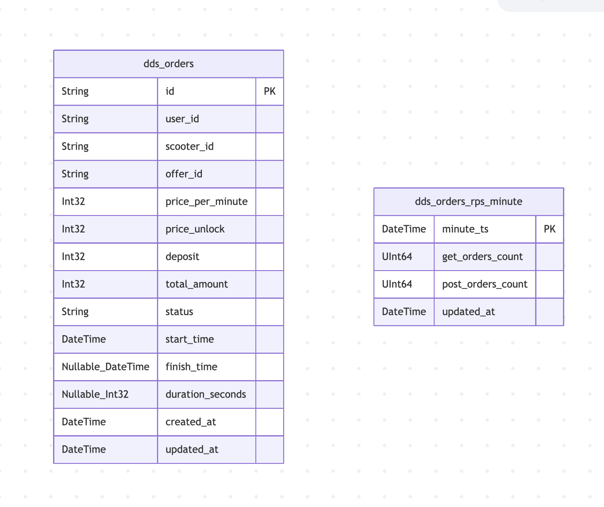
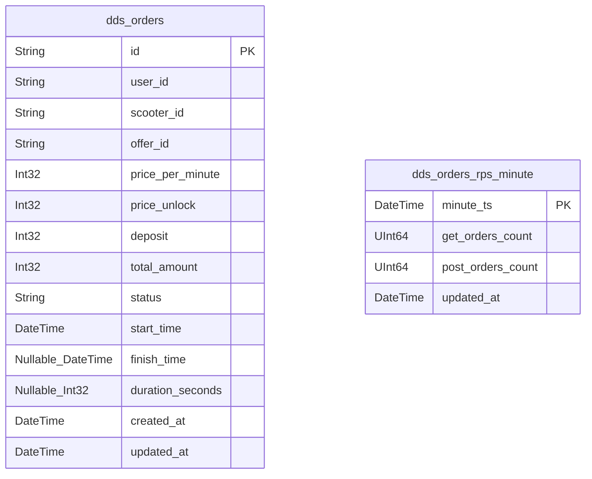

# Документация Хранилища Данных (DWH)

Этот документ описывает схему и таблицы в Хранилище Данных (ClickHouse).

## Слой DDS (Data Detail Store)

Слой DDS хранит детальные, гранулярные данные, полученные из операционных источников (PostgreSQL).

### ER-диаграмма

### Таблицы

#### `analytics.dds_orders`

Содержит детальную информацию о каждом заказе.

| Имя колонки | Тип | Описание |
| :--- | :--- | :--- |
| `id` | `String` | Уникальный идентификатор заказа. |
| `user_id` | `String` | Идентификатор пользователя, сделавшего заказ. |
| `scooter_id` | `String` | Идентификатор самоката, использованного в заказе. |
| `offer_id` | `String` | Идентификатор ценового предложения, примененного к заказу. |
| `price_per_minute` | `Int32` | Цена за минуту в копейках. |
| `price_unlock` | `Int32` | Цена разблокировки в копейках. |
| `deposit` | `Int32` | Сумма депозита в копейках. |
| `total_amount` | `Int32` | Общая стоимость заказа в копейках. |
| `status` | `String` | Текущий статус заказа (например, STARTED, FINISHED). |
| `start_time` | `DateTime` | Временная метка начала заказа. |
| `finish_time` | `Nullable(DateTime)` | Временная метка завершения заказа. |
| `duration_seconds` | `Nullable(Int32)` | Длительность заказа в секундах. |
| `created_at` | `DateTime` | Временная метка создания записи. |
| `updated_at` | `DateTime` | Временная метка последнего обновления записи. |

*   **Engine**: `ReplacingMergeTree(updated_at)`
*   **Partition Key**: `toYYYYMM(updated_at)`
*   **Order Key**: `(id)`

#### `analytics.dds_orders_rps_minute`

Хранит количество запросов в секунду (RPS) к API заказов, агрегированное по минутам.

| Имя колонки | Тип | Описание |
| :--- | :--- | :--- |
| `minute_ts` | `DateTime` | Временная метка начала минуты. |
| `get_orders_count` | `UInt64` | Количество GET-запросов к /orders за эту минуту. |
| `post_orders_count` | `UInt64` | Количество POST-запросов к /orders за эту минуту. |
| `updated_at` | `DateTime` | Временная метка последнего обновления записи. |

*   **Engine**: `ReplacingMergeTree(updated_at)`
*   **Partition Key**: `toYYYYMM(minute_ts)`
*   **Order Key**: `(minute_ts)`

## Слой витрин данных (Marts)

Слой витрин содержит агрегированные данные, готовые для отчетности и анализа.

### Таблицы

#### `analytics.mart_rps_minute`

Агрегированные метрики RPS, рассчитанные на основе `dds_orders_rps_minute`.

| Имя колонки | Тип | Описание |
| :--- | :--- | :--- |
| `minute_ts` | `DateTime` | Временная метка начала минуты. |
| `get_rps` | `Float64` | Среднее количество GET-запросов в секунду. |
| `post_rps` | `Float64` | Среднее количество POST-запросов в секунду. |
| `get_orders_count` | `UInt64` | Общее количество GET-запросов. |
| `post_orders_count` | `UInt64` | Общее количество POST-запросов. |

*   **Engine**: `MergeTree`
*   **Partition Key**: `toYYYYMM(minute_ts)`
*   **Order Key**: `(minute_ts)`

#### `analytics.mart_orders_minute`

Агрегированные метрики заказов по минутам, рассчитанные на основе `dds_orders`.

| Имя колонки | Тип | Описание |
| :--- | :--- | :--- |
| `minute_ts` | `DateTime` | Временная метка начала минуты (на основе `start_time`). |
| `orders_total` | `UInt64` | Общее количество заказов, начатых в эту минуту. |
| `orders_finished` | `UInt64` | Количество завершенных заказов. |
| `orders_active` | `UInt64` | Количество активных заказов. |
| `orders_cancelled` | `UInt64` | Количество отмененных заказов. |
| `orders_payment_failed` | `UInt64` | Количество заказов с ошибкой оплаты. |
| `revenue_total` | `Int64` | Общая выручка. |
| `avg_duration_seconds_finished` | `Float64` | Средняя длительность завершенных заказов. |
| `avg_total_amount_finished` | `Float64` | Средняя общая стоимость завершенных заказов. |
| `avg_price_unlock_finished` | `Float64` | Средняя цена разблокировки завершенных заказов. |
| `avg_price_per_minute_finished` | `Float64` | Средняя цена за минуту завершенных заказов. |

*   **Engine**: `MergeTree`
*   **Partition Key**: `toYYYYMM(minute_ts)`
*   **Order Key**: `(minute_ts)`
